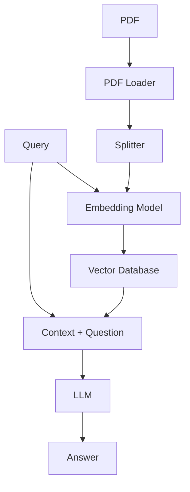

# RAG (Retrieval-Augmented Generation) System using LangChain and Streamlit

This project is a Retrieval-Augmented Generation (RAG) system designed to query customized documents such as PDFs and can be scaled to accommodate other types of documents. The system utilizes LangChain, Streamlit, and Pinecone as the vector database.

## Project Overview

The flow of the project is illustrated below:



## Components

1. **Document Loaders**: Responsible for loading documents of various types (HTML, PDF, TXT) into the system.
2. **Splitter**: Splits the loaded documents into manageable chunks for processing.
3. **Embedding Model**: Converts document chunks into embeddings.
4. **VectorDB (Pinecone)**: Stores and retrieves embeddings efficiently.
5. **Query**: User's input query that needs to be answered.
6. **Context and Question**: The context retrieved from the VectorDB and the user's question.
7. **LLM (Large Language Model)**: Processes the context and question to generate an answer.

## Project Structure

```
rag_langchain
├── README.md
├── data_source
│   ├── download.py  # Script to download data sources
│   ├── pdf_file     # Directory containing PDF files for the project
│   └── pdf_file_test
│       └── Attention_Is_All_You_Need.pdf  # Sample PDF file for testing
├── notebooks
│   ├── document_loaders.ipynb  # Jupyter notebook for testing document loaders
│   ├── retriever.ipynb         # Jupyter notebook for testing the retriever
│   ├── test.ipynb              # Jupyter notebook for various tests
│   └── vector_db.ipynb         # Jupyter notebook for testing vector database interactions
├── requirements.txt  # List of project dependencies
└── src
    ├── build_db.py  # Script to build the vector database
    ├── const.py     # File containing project constants
    ├── document_loaders
    │   ├── base.py  # Base class for document loaders
    │   └── pdf.py   # PDF document loader implementation
    ├── model
    │   └── llms.py  # Script containing LLM-related functionalities
    ├── splitters
    │   └── text_splitter.py  # Script for splitting text into chunks
    └── vector_db
        ├── pinecone_db.py   # Pinecone vector database implementation
        └── vector_db_base.py  # Base class for vector databases
```

## How to Run

### Prerequisites

- Python 3.8+
- Streamlit
- LangChain
- Pinecone

### Installation

1. Clone the repository:

    ```bash
    git clone https://github.com/acn-thaihanguyen/rag_langchain.git
    cd rag_langchain
    ```

2. Create a virtual environment and install the required packages:

    ```bash
    python -m venv .venv
    source .venv/bin/activate
    pip install -r requirements.txt
    ```

3. Set up Pinecone:
    - Sign up at [Pinecone](https://www.pinecone.io/) and get your API key.
    - Create an index on Pinecone for storing document embeddings.

4. Set up your environment variables:
    - Create a `.env` file in the project root and add your OpenAI and Pinecone API keys (examples provided in .env.sample)

    ```bash
    OPENAI_API_KEY=your-openai-api-key
    PINECONE_API_KEY=your-pinecone-api-key
    ```

5. Build a vector store DB using Pinecone

    ```bash
    python src/build_db.py <folder_containing_pdf_files>
    ```

## Acknowledgements

- [LangChain](https://github.com/langchain-ai/langchain)
- [Streamlit](https://www.streamlit.io/)
- [Pinecone](https://www.pinecone.io/)

## License

This project is licensed under the MIT License.
